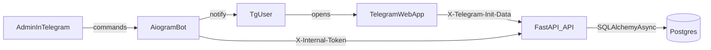

# PPL Bets — Telegram Web App + Bot (portfolio)

Мини-платформа ставок внутри Telegram:

- **Telegram Web App (React + Vite + TS)**: матчи, коэффициенты, ставка, баланс, история ставок.
- **API (FastAPI)**: бизнес-логика, авторизация через **Telegram `initData`**, работа с Postgres.
- **Bot (aiogram)**: entrypoint для пользователей (кнопка Web App), админ-команды (создание/старт/завершение матчей).
- **DB (Postgres)**: пользователи/матчи/ставки.

## Архитектура



## Быстрый старт (Docker Compose)

1) Скопируй env:

```bash
cp .env.example .env
```

2) Заполни в `.env`:

- **`BOT_TOKEN`** — токен Telegram-бота
- **`INTERNAL_API_TOKEN`** — общий секрет для `bot -> api` (любой длинный)
- **`ADMINS`** — список админов (Telegram user id), через запятую
- **`DB_*`** — параметры Postgres
- **`WEBAPP_URL`** — откуда будет открываться Web App (для CORS)

3) Подними стек:

```bash
docker compose up --build
```

После старта:

- Web App: `http://localhost:5173`
- API: `http://localhost:8000/health`

API контейнер при старте сам выполняет миграции Alembic: `upgrade head`.

## Как открыть Web App из Telegram

Бот отправляет кнопку Web App в `/start`. Укажи корректный `WEBAPP_URL`:

- локально: `http://localhost:5173`
- прод: твой домен (HTTPS обязателен для Telegram Web App)

## Админ-команды в боте

- **`/addmatch`** — создать матч (статус `scheduled`)
- **`/setlive`** — перевести матч в `live` (только `live` доступен для ставок)
- **`/finishmatch`** — выбрать победителя и закрыть матч (`finished`) + начислить выплаты

## Авторизация Web App (Telegram initData)

Web App передаёт `initData` в API через заголовок **`X-Telegram-Init-Data`**.
API валидирует подпись по `BOT_TOKEN` (HMAC по спецификации Telegram Web Apps).

Для локальной разработки без Telegram можно включить:

- `ALLOW_DEBUG_AUTH=true` и передавать заголовок `X-Debug-User-Id`.

## Разработка без Docker

Backend:

```bash
pip install -r requirements.txt
set BOT_TOKEN=...
set DB_USER=...
...
uvicorn app.main:app --app-dir api --reload
```

Web:

```bash
cd web
npm install
npm run dev
```

## Качество

- Линтинг: `ruff`
- Тесты: `pytest`
- CI: GitHub Actions (`.github/workflows/ci.yml`)

